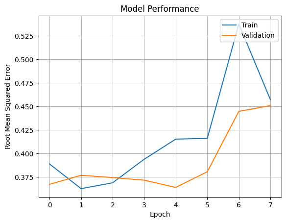

# Laporan Proyek Machine Learning - Sandy Sanjaya

## Project Overview

Dalam era digital saat ini, sistem rekomendasi telah menjadi elemen penting dalam berbagai layanan berbasis teknologi. Platform seperti YouTube, Amazon, dan Netflix telah membuktikan bagaimana algoritma rekomendasi mampu meningkatkan pengalaman pengguna secara signifikan dengan menyarankan konten yang relevan berdasarkan preferensi dan perilaku mereka. Dalam konteks ini, sistem rekomendasi tidak hanya berfungsi sebagai alat bantu, tetapi juga sebagai strategi bisnis yang dapat meningkatkan keterlibatan pengguna dan pendapatan perusahaan [1].

Secara umum, sistem rekomendasi merupakan pendekatan berbasis data yang dirancang untuk menyarankan item—seperti produk, film, atau buku—yang kemungkinan besar akan disukai oleh pengguna. Algoritma yang digunakan biasanya memanfaatkan pola interaksi historis antara pengguna dan item, baik melalui metode kolaboratif, konten, maupun pendekatan hibrida. Salah satu indikator penting dari signifikansi sistem rekomendasi adalah kompetisi “Netflix Prize” yang diselenggarakan pada tahun 2006, di mana Netflix menawarkan hadiah sebesar satu juta dolar AS kepada siapa pun yang dapat mengembangkan algoritma rekomendasi yang mengungguli sistem internal mereka [2].

Dalam ranah literasi digital dan industri buku, sistem rekomendasi memiliki potensi yang tidak kalah besar. Banyaknya jumlah buku yang tersedia membuat pembaca kesulitan menemukan buku yang sesuai dengan minat mereka. Di sinilah sistem rekomendasi berperan penting: memberikan saran yang dipersonalisasi berdasarkan histori penilaian dan preferensi pengguna. Penerapan teknologi ini tidak hanya meningkatkan pengalaman membaca, tetapi juga membantu penerbit dan toko buku daring dalam meningkatkan eksposur buku serta mendorong pertumbuhan penjualan.

Proyek ini bertujuan untuk membangun sistem rekomendasi buku yang berbasis data historis rating pengguna terhadap buku. Dengan memanfaatkan dataset dari Kaggle [3], proyek ini mengembangkan model rekomendasi yang mampu memberikan saran buku yang relevan dan bermanfaat bagi pengguna. Implementasi sistem seperti ini diharapkan dapat menjadi bagian dari solusi peningkatan literasi serta mendukung transformasi digital dalam industri perbukuan.

### Referensi:
[1] J. Ben Schafer, Joseph A. Konstan, and John Riedl, “E-Commerce Recommendation Applications,” *Data Mining and Knowledge Discovery*, vol. 5, no. 1-2, pp. 115–153, 2001.  
[2] J. Bennett and S. Lanning, “The Netflix Prize,” in *Proceedings of KDD Cup and Workshop*, 2007.  
[3] A. Nican, “Book Recommendation Dataset,” *Kaggle*, [Online]. Available: https://www.kaggle.com/datasets/arashnic/book-recommendation-dataset

## Business Understanding

Sistem rekomendasi merupakan bagian penting dalam mempersonalisasi pengalaman pengguna di berbagai platform digital, termasuk platform literasi dan penjualan buku. Dengan memanfaatkan data historis berupa rating pengguna terhadap buku, sistem dapat memberikan rekomendasi buku lain yang sesuai dengan preferensi pengguna, bahkan jika buku tersebut belum pernah dibaca sebelumnya.

Pada bagian ini, akan dijelaskan proses klarifikasi masalah, tujuan dari proyek, serta pendekatan solusi yang digunakan untuk membangun sistem rekomendasi buku.

---

### Problem Statements

1. **Bagaimana mengidentifikasi pola preferensi pengguna terhadap buku berdasarkan data rating yang tersedia?**

2. **Bagaimana menyarankan buku yang belum pernah dibaca oleh pengguna, namun memiliki kemungkinan besar untuk disukai, berdasarkan kesamaan preferensi antar pengguna?**

3. **Bagaimana menyajikan hasil eksplorasi data dalam bentuk visualisasi untuk mendukung proses analisis dan pemodelan sistem rekomendasi?**

---

### Goals

1. **Mengolah data rating pengguna untuk memahami distribusi preferensi dan interaksi antar pengguna dan buku.**

2. **Membangun sistem rekomendasi berbasis collaborative filtering yang mampu menyarankan buku sesuai dengan selera pengguna yang memiliki pola interaksi serupa.**

3. **Menyajikan hasil eksplorasi data dalam bentuk visualisasi (seperti bar plot) untuk memberikan wawasan mengenai distribusi rating, usia pengguna, dan buku paling populer.**

---

### Solution Statements

Untuk mencapai tujuan yang telah ditentukan, proyek ini menggunakan pendekatan berikut:

1. **Neural Collaborative Filtering (NCF)**  
   Sistem rekomendasi ini menggunakan representasi embedding untuk memetakan pengguna dan buku ke dalam ruang vektor berdimensi rendah, lalu menghitung kemiripan atau interaksi antar keduanya menggunakan operasi dot product. Model ini dibangun dengan TensorFlow menggunakan layer `Embedding` untuk user dan item, serta dioptimasi untuk memprediksi rating dengan pendekatan regresi berbasis sigmoid.

   Keunggulan pendekatan ini adalah kemampuannya menangkap hubungan non-linear antara user dan item, serta fleksibilitas dalam pengembangan model yang lebih kompleks di masa depan.

2. **Visualisasi Eksploratif untuk Mendukung Rekomendasi**  
   Sebelum membangun model, dilakukan eksplorasi data melalui visualisasi seperti *bar plot* terhadap rating buku, usia pengguna, dan sebaran interaksi. Visualisasi ini membantu memahami distribusi data dan mendukung proses pengambilan keputusan dalam pemodelan.

Melalui pendekatan ini, sistem rekomendasi yang dibangun diharapkan mampu memberikan hasil yang relevan dan akurat berdasarkan preferensi pengguna yang tersirat dalam data rating.

## Data Understanding

Data Understanding merupakan tahap awal yang krusial dalam pengembangan proyek *Machine Learning* maupun *Data Science*. Tahap ini bertujuan untuk memahami isi, struktur, serta kualitas data yang akan dianalisis agar proses analisis selanjutnya dapat berjalan secara optimal.

Pada proyek ini, proses *Data Understanding* dilakukan melalui tiga tahapan utama berikut:

1. **Memuat dan memeriksa struktur dataset**  
2. **Melakukan *Univariate Exploratory Data Analysis***  
3. **Melakukan visualisasi data untuk memahami pola dan distribusi**

### Sumber Dataset

Dataset yang digunakan dalam proyek ini bersumber dari [Book Recommendation Dataset](https://www.kaggle.com/datasets/arashnic/book-recommendation-dataset) yang tersedia di Kaggle. Dataset ini merupakan kumpulan data populer yang sering digunakan untuk membangun sistem rekomendasi buku. Dataset terdiri atas tiga file utama:

| Nama File     | Deskripsi                                                              | Jumlah Baris | Jumlah Kolom |
|---------------|-------------------------------------------------------------------------|--------------|---------------|
| `Users.csv`   | Berisi informasi pengguna seperti ID, lokasi, dan usia                 | 278,858      | 3             |
| `Ratings.csv` | Berisi rating buku dari masing-masing pengguna                         | 1,149,780    | 3             |
| `Books.csv`   | Berisi detail buku seperti ISBN, judul, penulis, dan penerbit          | 271,360      | 8             |

---

### Penjelasan Variabel

#### 1. Users

Dataset ini berisi informasi pengguna yang meliputi user_id, lokasi, dan usia.

| Kolom      | Deskripsi                                                                 |
|------------|---------------------------------------------------------------------------|
| `User_id`  | ID unik yang merepresentasikan masing-masing pengguna.                   |
| `Location` | Lokasi geografis pengguna (negara/kota/kode pos).                        |
| `Age`      | Usia pengguna (dapat berisi nilai kosong atau tidak valid).              |

---

#### 2. Ratings

Dataset ini merepresentasikan rating atau penilaian yang diberikan pengguna terhadap buku tertentu.

| Kolom     | Deskripsi                                                             |
|-----------|----------------------------------------------------------------------|
| `User_id` | ID pengguna yang memberi rating.                                     |
| `ISBN`    | ID buku yang dinilai.                                                |
| `Rating`  | Nilai rating yang diberikan (rentang 0–10; 0 bisa berarti tidak eksplisit). |

---

#### 3. Books

Dataset ini mencakup detail informasi buku yang ada di sistem.

| Kolom              | Deskripsi                                                                   |
|--------------------|------------------------------------------------------------------------------|
| `ISBN`             | Nomor unik identifikasi buku.                                               |
| `Title`            | Judul buku.                                                                 |
| `Author`           | Nama penulis buku.                                                          |
| `Year`             | Tahun publikasi buku.                                                       |
| `Publisher`        | Nama penerbit buku.                                                         |
| `Image-URL-S/M/L`  | URL gambar cover buku (kecil, sedang, besar) — dihapus karena tidak digunakan. |

---

### Eksploratory Data Analysis (EDA)
Untuk memperkuat pemahaman terhadap karakteristik dataset, berikut adalah beberapa visualisasi yang dilakukan:
#### 1. Top Contributors in Book Dataset

**Insight**:
- Tahun terbit terbanyak: 2002, disusul 2001 dan 2000.
- Penerbit terbanyak:
  1. Harlequin
  2. Silhouette
  3. Pocket Books
  4. Ballantine Books
- Penulis terbanyak:
  1. Agatha Christie
  2. William Shakespeare
  3. Stephen King
  4. Ann M. Martin

---
#### 2. Distribution of Book Ratings

**Insight**:
- Rating 0 mendominasi (>700.000 entri) → menunjukkan **rating implisit**.
- Rating eksplisit (1–10) didominasi nilai tinggi:
  - Tertinggi pada rating 8, 10, dan 7.
  - Rating rendah (1–4) sangat sedikit.
- Pengguna cenderung hanya memberi rating pada buku yang mereka sukai.

---
#### 3. 20 top location of the users

**Insight**:
- Mayoritas pengguna berasal dari negara-negara berbahasa Inggris.
- Lokasi pengguna terbanyak:
  - London, England, United Kingdom (>2.500 pengguna)
  - Toronto, Ontario (Canada)
  - Sydney, New South Wales (Australia)
  - Kota-kota besar di AS seperti Portland, Chicago, Seattle, New York, dan San Francisco.
  - Eropa: Madrid (Spanyol), Berlin (Jerman), Milano (Italia).
- Ini menunjukkan dominasi pengguna dari Amerika Utara, Eropa Barat, dan Australia — penting untuk mempertimbangkan keragaman budaya dalam sistem rekomendasi.

## Data Preparation

Tahap *Data Preparation* bertujuan untuk memastikan bahwa data yang digunakan dalam model sistem rekomendasi berada dalam kondisi optimal. Proses ini mencakup pembersihan data, penggabungan data, seleksi subset data, hingga transformasi data untuk kebutuhan algoritma *Collaborative Filtering*.

### Pembersihan Data

Beberapa langkah pembersihan data yang dilakukan dalam proyek ini meliputi:

#### 1. Menangani Missing Values

- **Kolom `Age` pada dataset `Users`**  
  Nilai kosong diisi menggunakan **modus (nilai yang paling sering muncul)**. Pendekatan ini dipilih karena dianggap dapat mewakili mayoritas usia pengguna dan meminimalkan distorsi terhadap distribusi data.

- **Kolom `Author` dan `Publisher` pada dataset `Books`**  
  Karena jumlah missing values sangat sedikit, maka baris yang mengandung nilai kosong pada kolom ini dihapus untuk menjaga integritas data.

- **Kolom `Image-URL-S`, `Image-URL-M`, dan `Image-URL-L`**  
  Kolom-kolom ini dihapus karena informasi gambar tidak digunakan dalam sistem rekomendasi. Penghapusan dilakukan untuk menyederhanakan struktur data dan mempercepat proses pemrosesan.

#### 2. Mengecek dan Menangani Duplikasi

Setelah dilakukan pengecekan terhadap ketiga dataset (`Users`, `Ratings`, dan `Books`), tidak ditemukan baris duplikat. Hal ini menunjukkan bahwa setiap entri bersifat unik dan tidak ada pengulangan informasi, sehingga tidak diperlukan proses penghapusan duplikasi.

#### 3. Data Merging 

- Dataset **Ratings** digabungkan dengan **Books** berdasarkan `ISBN`, menghasilkan lebih dari **1 juta baris data**.
- Setiap interaksi kini dilengkapi:
  - UserId
  - ISBN
  - Rating
  - Judul buku
  - Penulis
  - Tahun terbit
  - Penerbit

#### 4. Mengelompokkan Data Rating Berdasarkan `user_id` dan Mengambil 20 Pengguna dengan Jumlah Rating Terbanyak

Dari analisis data rating, ditemukan 20 pengguna paling aktif dengan jumlah rating terbanyak. Informasi ini penting karena pengguna aktif berkontribusi besar dalam membentuk pola rekomendasi sistem. Rata-rata rating yang mereka berikan juga membantu memahami kecenderungan penilaian masing-masing pengguna, yang berguna untuk meningkatkan akurasi rekomendasi.

Berikut adalah 20 pengguna teratas berdasarkan jumlah rating terbanyak:

| No. | user_id | count  | mean     |
|-----|---------|--------|----------|
| 1   | 4213    | 13602  | 4.564197 |
| 2   | 74815   | 7550   | 0.165921 |
| 3   | 58113   | 6109   | 2.786872 |
| 4   | 37356   | 5891   | 8.728230 |
| 5   | 13576   | 5850   | 1.078597 |
| 6   | 80185   | 4785   | 0.003135 |
| 7   | 105111  | 4353   | 0.159276 |
| 8   | 28884   | 3367   | 0.145233 |
| 9   | 42037   | 3100   | 0.787742 |
| 10  | 88584   | 3067   | 2.671992 |
| 11  | 86808   | 2991   | 0.911735 |
| 12  | 6111    | 2948   | 2.334803 |
| 13  | 88400   | 2740   | 0.132760 |
| 14  | 13950   | 2529   | 0.480427 |
| 15  | 19872   | 2512   | 0.477309 |
| 16  | 92807   | 2507   | 0.140806 |
| 17  | 77063   | 2504   | 1.780751 |
| 18  | 21044   | 2459   | 0.372102 |
| 19  | 69817   | 2448   | 1.524918 |
| 20  | 64531   | 2421   | 3.147047 |

#### 5. Mengelompokkan Data Berdasarkan Judul Buku dan Mengurutkan dari Jumlah Rating Terbanyak

Dari hasil pengelompokan data berdasarkan judul buku, ditemukan 20 buku yang paling banyak mendapatkan rating dari pengguna. Buku-buku ini memiliki tingkat popularitas tinggi karena sering dinilai oleh banyak pengguna. Selain itu, informasi rata-rata rating pada masing-masing buku juga membantu mengukur seberapa baik buku tersebut diterima. Data ini sangat berguna untuk mengidentifikasi buku-buku populer dan berkualitas, yang dapat dijadikan prioritas dalam sistem rekomendasi.

Berikut adalah 20 judul buku teratas berdasarkan jumlah rating terbanyak:

| No. | Title                                             | Count | Mean     |
|-----|---------------------------------------------------|-------|----------|
| 1   | Wild Animus                                       | 2502  | 1.019584 |
| 2   | The Lovely Bones: A Novel                         | 1295  | 4.468726 |
| 3   | The Da Vinci Code                                 | 898   | 4.642539 |
| 4   | A Painted House                                   | 838   | 3.231504 |
| 5   | The Nanny Diaries: A Novel                        | 828   | 3.530193 |
| 6   | Bridget Jones's Diary                             | 815   | 3.527607 |
| 7   | The Secret Life of Bees                           | 774   | 4.470528 |
| 8   | Divine Secrets of the Ya-Ya Sisterhood: A Novel   | 740   | 3.437388 |
| 9   | The Red Tent (Bestselling Backlist)               | 723   | 3.434716 |
| 10  | Angels & Demons                                   | 670   | 3.708955 |
| 11  | Life of Pi                                        | 664   | 4.088559 |
| 12  | Snow Falling on Cedars                            | 662   | 3.252266 |
| 13  | The Summons                                       | 655   | 3.432061 |
| 14  | The Notebook                                      | 650   | 3.560000 |
| 15  | The Testament                                      | 617   | 3.179903 |
| 16  | House of Sand and Fog                             | 588   | 3.030612 |
| 17  | Where the Heart Is (Oprah's Book Club)            | 583   | 4.105983 |
| 18  | The Pelican Brief                                 | 581   | 2.611015 |
| 19  | Harry Potter and the Sorcerer's Stone             | 575   | 4.896562 |
| 20  | Summer Sisters                                     | 573   | 3.612457 |

#### 6. Mengecek dan Menangani Duplikat pada Dataset Gabungan
Selanjutnya dilakukan pemeriksaan terhadap dataset gabungan untuk mengetahui keberadaan data duplikat. Berdasarkan hasil analisis, **tidak ditemukan duplikasi**, sehingga tidak diperlukan penghapusan data pada tahap ini.

#### 7. Mengecek dan Menangani Missing Values pada Dataset Gabungan 
Hasil pemeriksaan menunjukkan bahwa dataset gabungan tidak mengandung missing values, sehingga tidak diperlukan proses imputasi atau penghapusan data pada tahap ini.

#### 8. Sampling Dataset  
Dataset gabungan memiliki lebih dari satu juta entri yang berpotensi memperlambat proses training. Oleh karena itu, dilakukan sampling sebanyak **500.000 data interaksi** dari gabungan dataset untuk menciptakan *dataframe* `data_small`. Sampling ini bertujuan untuk mempercepat eksplorasi dan pelatihan model tanpa kehilangan representativitas data.

---

### Preprocessing untuk Collaborative Filtering

#### 1. Menyalin Data  
Untuk menjaga keutuhan data asli, data hasil sampling disalin menjadi variabel baru yang digunakan khusus untuk proses training dan evaluasi model.

#### 2. Encoding  
Model collaborative filtering, khususnya berbasis neural network, membutuhkan input dalam bentuk numerik. Oleh karena itu, kolom `User_id` dan `ISBN` di-*encode* menjadi integer menggunakan `LabelEncoder`.  
Hasil encoding menunjukkan terdapat:
- **61.584 pengguna unik**
- **177.748 buku unik**

Hal ini menunjukkan cakupan dan keragaman interaksi yang cukup tinggi dalam dataset.

#### 3. Pembagian Data  
Setelah proses encoding, dataset dibagi menjadi dua bagian:
- **80% data training**
- **20% data testing**

Pembagian ini dilakukan secara acak untuk memastikan distribusi yang merata. Data training digunakan untuk melatih model mengenali pola interaksi pengguna dan buku, sementara data testing digunakan untuk mengevaluasi kemampuan model dalam memberikan prediksi yang akurat pada data yang belum pernah dilihat sebelumnya.

## Modeling

Pada tahap ini, fokus utama adalah mengembangkan sistem rekomendasi buku dengan menggunakan pendekatan **Collaborative Filtering**, khususnya dengan algoritma **Neural Collaborative Filtering (NCF)**. Pendekatan ini menganalisis pola interaksi antara pengguna dan buku — terutama dari data rating — untuk memahami preferensi pengguna yang memiliki kesamaan. Dengan mengenali pola tersebut, sistem dapat merekomendasikan buku-buku yang belum pernah dibaca oleh pengguna, namun disukai oleh pengguna lain dengan selera serupa.

### Model Neural Collaborative Filtering (NCF)

Model dibangun menggunakan TensorFlow dengan pendekatan **Neural Collaborative Filtering (NCF)** dan arsitektur khusus sebagai berikut:

- **User dan Book Embedding**  
  Layer `Embedding` digunakan untuk memetakan `user_id` dan `book_id` ke dalam vektor berdimensi rendah (50 dimensi), yang dapat menangkap fitur laten dari masing-masing entitas.

- **User Bias dan Book Bias**  
  Layer embedding tambahan digunakan untuk mempelajari bias dari pengguna dan buku secara terpisah. Bias ini penting untuk memperhitungkan kecenderungan pengguna tertentu atau popularitas buku tertentu secara umum.

- **Dot Product Layer**  
  Representasi vektor pengguna dan buku digabungkan menggunakan **dot product** yang mencerminkan tingkat kecocokan di antara keduanya.

- **Output Layer**  
  Hasil perhitungan dot product dan bias dijumlahkan, lalu diproses dengan **fungsi aktivasi sigmoid**, menghasilkan nilai antara 0 dan 1 yang merepresentasikan kemungkinan pengguna menyukai suatu buku.

- **Loss Function dan Optimizer**  
  Model menggunakan **Binary Crossentropy** karena pendekatannya serupa dengan klasifikasi biner terhadap kesukaan pengguna, serta dioptimalkan dengan **Adam Optimizer**. Metrik utama yang digunakan adalah **Root Mean Squared Error (RMSE)** untuk menilai akurasi prediksi.

Model dilatih selama **8 epoch**, dengan metrik evaluasi utama yaitu **Root Mean Squared Error (RMSE)** pada data training dan validation.

#### Insight Model:
Hasil pelatihan selama 8 epoch menunjukkan bahwa model mencapai performa validasi terbaik pada epoch kelima dengan RMSE validasi sebesar 0.3640. Setelah itu, performa mulai menurun secara bertahap, yang mengindikasikan adanya overfitting. Hal ini terlihat jelas pada epoch 7 dan 8, di mana nilai loss dan RMSE meningkat tajam, menunjukkan bahwa model tidak lagi belajar dengan optimal dari data. Di akhir pelatihan (epoch 8), performa validasi tetap menurun. Namun, tidak mampu melebihi performa terbaik sebelumnya.

### Output: Top 10 Book Recommendation

Model berhasil memberikan **top-10 rekomendasi buku** untuk pengguna tertentu. Berikut adalah contoh hasil rekomendasi:

- Harry Potter and the Chamber of Secrets (Book 2)
- Harry Potter and the Goblet of Fire (Book 4)
- Harry Potter and the Sorcerer's Stone (Book 1)
- The Lovely Bones: A Novel
- Free
- The Hobbit : The Enchanting Prelude to The Lord of the Rings
- Harry Potter and the Prisoner of Azkaban (Book 3)
- Coraline
- The Da Vinci Code
- Sam's Letters to Jennifer

Rekomendasi ini menunjukkan bahwa model berhasil menangkap preferensi pengguna terhadap genre **fantasi populer**, **novel klasik**, dan **kisah bernuansa emosional** atau **historis**. Dominasi buku dari seri *Harry Potter* juga mengindikasikan bahwa sistem mengenali konsistensi minat pengguna terhadap suatu franchise atau penulis.

### Kelebihan dan Kekurangan

| Aspek              | Penjelasan |
|--------------------|-----------|
| **Kelebihan**      | - Mampu mengenali pola kompleks melalui representasi embedding. - Dapat memberikan rekomendasi personal berdasarkan interaksi historis. - Fleksibel untuk dikembangkan menjadi model yang lebih kompleks di masa depan. |
| **Kekurangan**     | - Membutuhkan data yang cukup besar dan bervariasi. - Rentan terhadap overfitting jika tidak diatur dengan baik (misalnya terlalu banyak epoch). - Tidak dapat memberikan rekomendasi untuk pengguna atau buku baru yang belum ada interaksi (**cold start problem**). |

---

Model Collaborative Filtering berbasis neural ini menunjukkan performa yang baik pada data validasi awal dan menghasilkan rekomendasi yang relevan secara personal. Dengan tuning dan data tambahan, model ini memiliki potensi besar untuk dikembangkan lebih lanjut.

## Evaluation

Tahap **evaluasi** bertujuan untuk mengukur sejauh mana model rekomendasi yang dikembangkan mampu memberikan prediksi yang akurat dan relevan terhadap preferensi pengguna. Pada proyek ini, metrik evaluasi yang digunakan adalah **Root Mean Squared Error (RMSE)**, yang umum digunakan dalam sistem rekomendasi berbasis prediksi rating.

### Metrik Evaluasi: Root Mean Squared Error (RMSE)

RMSE mengukur seberapa jauh prediksi model dari nilai aktualnya. Semakin kecil nilai RMSE, semakin akurat model dalam memprediksi rating.

### Hasil Evaluasi

Model dievaluasi menggunakan data validasi selama proses pelatihan sebanyak 8 epoch. Berikut adalah grafik performa model berdasarkan nilai RMSE pada data training dan validation:

**Insight dari Grafik:**
Hasil pelatihan selama 8 epoch menunjukkan bahwa model mencapai performa validasi terbaik pada epoch kelima dengan RMSE validasi sebesar 0.3640. Setelah itu, performa mulai menurun secara bertahap, yang mengindikasikan adanya overfitting. Hal ini terlihat jelas pada epoch 6 dan 7, di mana nilai loss dan RMSE meningkat tajam, menunjukkan bahwa model tidak lagi belajar dengan optimal dari data. Di akhir pelatihan (epoch 8), performa validasi sedikit membaik, namun tetap belum melebihi performa terbaik pada epoch kelima.

## Kesimpulan Evaluasi (Berbasis Metrik)

- Model menggunakan **metrik RMSE** dan tren performa model selama proses training dan validasi.
- Model **Neural Collaborative Filtering (NCF)** menghasilkan performa validasi terbaik pada epoch kelima dengan **RMSE = 0.3640**, sebelum mengalami overfitting pada epoch-epoch berikutnya.
- Hasil evaluasi menunjukkan bahwa untuk data interaksi pengguna-buku dengan skala besar dan kompleksitas tinggi, pendekatan **deep learning berbasis collaborative filtering** mampu mempelajari pola tersembunyi preferensi pengguna secara efektif.

---

### 1. Kesesuaian dengan Problem Statements
- ✅ **Prediksi preferensi buku pengguna** berhasil dilakukan dengan baik menggunakan pendekatan collaborative filtering. Sistem mampu menyarankan buku-buku yang belum pernah dibaca, namun cenderung disukai oleh pengguna berdasarkan interaksi serupa dari pengguna lain.
- ✅ Model memberikan rekomendasi **yang sangat relevan**, seperti dominasi seri *Harry Potter*, yang menunjukkan kemampuan model menangkap pola ketertarikan pengguna terhadap genre tertentu (fantasi/populer).
- ✅ Visualisasi dan analisis distribusi data mendukung pemahaman konteks pengguna dan buku, sehingga pengolahan data mampu menjawab tantangan utama dalam membangun sistem rekomendasi berbasis histori rating.

---

### 2. Pencapaian Goals
- 🎯 Proyek berhasil **mengolah data rating, pengguna, dan buku** secara menyeluruh dan membentuk dataset representatif melalui proses sampling, encoding, dan normalisasi.
- 🎯 Model rekomendasi mampu memberikan **top-N recommendation** yang akurat dan personal, menjawab kebutuhan sistem untuk meningkatkan pengalaman membaca dan eksplorasi buku pengguna.
- 🎯 Hasil visualisasi mendalam pada tahap data understanding mengungkap informasi kunci tentang tren pengguna aktif, distribusi usia, dan buku paling populer yang memperkuat strategi rekomendasi.

---

### 3. Dampak dari Solution Statements
- 💡 Pendekatan **Neural Collaborative Filtering** memberikan fleksibilitas dan kekuatan dalam menangkap **relasi non-linear** antar pengguna dan item.
- 💡 Evaluasi berbasis metrik RMSE memungkinkan penilaian performa yang objektif dan akurat, serta membantu identifikasi titik optimal pelatihan model.
- 💡 Sistem rekomendasi ini memiliki **potensi langsung untuk diintegrasikan ke platform literasi digital**, toko buku online, atau aplikasi edukatif yang membutuhkan personalisasi dalam penyajian konten buku.

---

## 📌 Kesimpulan Umum

Proyek sistem rekomendasi buku ini membuktikan bahwa pendekatan berbasis **machine learning dan deep learning** sangat efektif untuk memahami dan memprediksi preferensi pengguna dalam dunia literasi digital. Dengan memanfaatkan **data historis interaksi pengguna**, model dapat merekomendasikan buku-buku yang personal dan relevan, sehingga:

- Meningkatkan pengalaman eksplorasi dan membaca buku,
- Membantu pengguna menemukan konten yang sesuai dengan minat mereka,
- Mendukung pertumbuhan ekosistem digital literasi melalui personalisasi konten.

Dengan demikian, sistem rekomendasi ini tidak hanya sukses dari sisi teknis, tetapi juga memberikan **nilai strategis dan praktis** bagi pengembangan teknologi pendidikan dan industri buku berbasis data.

